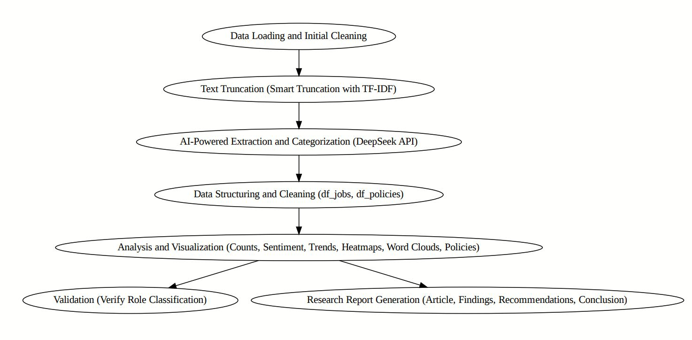
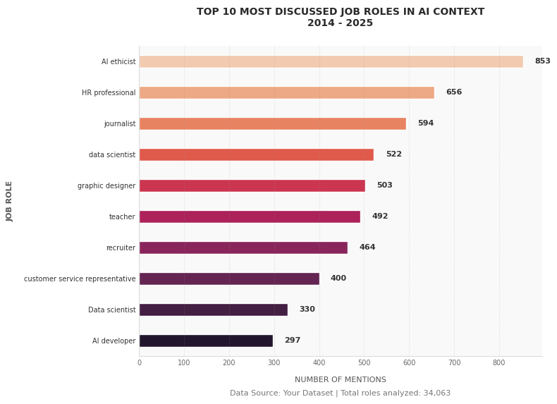
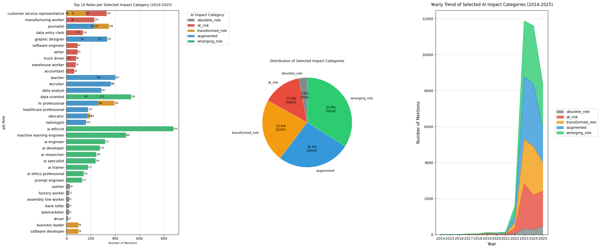
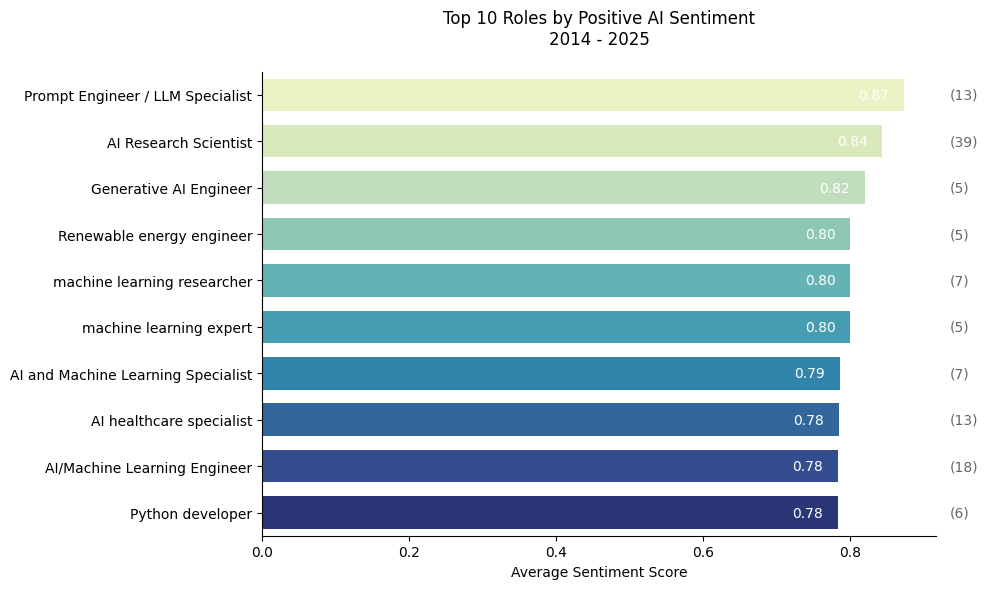
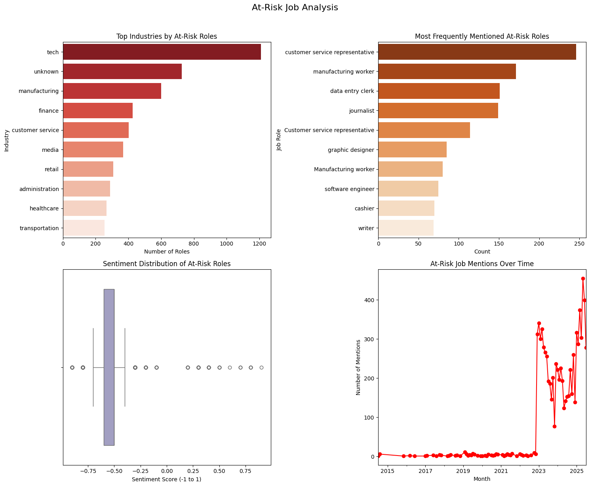
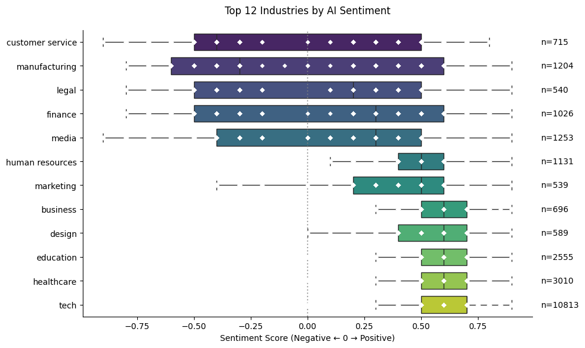
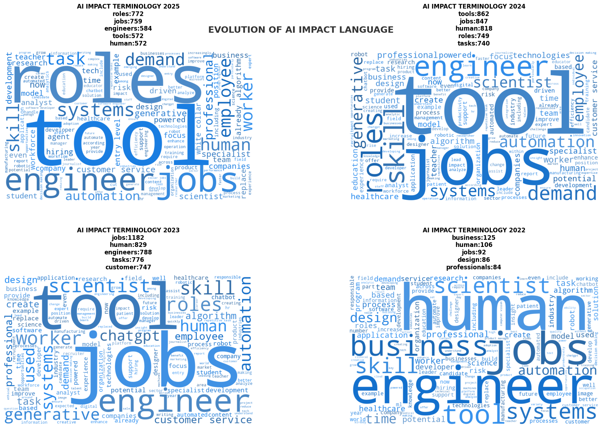
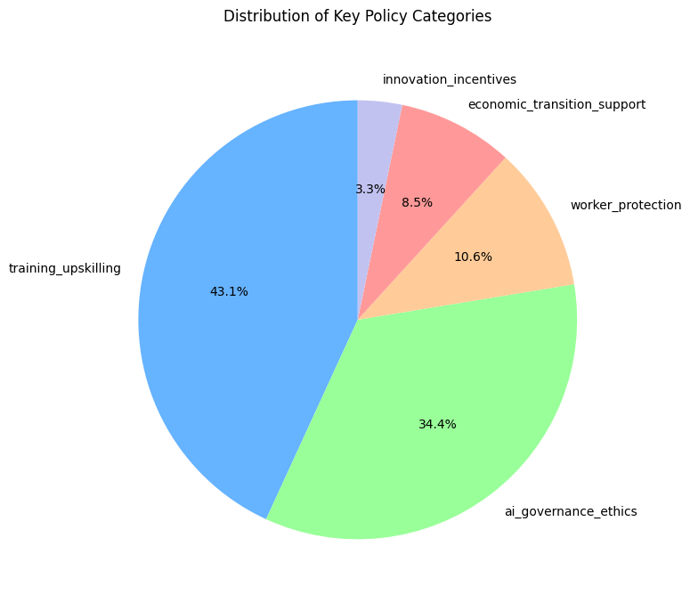
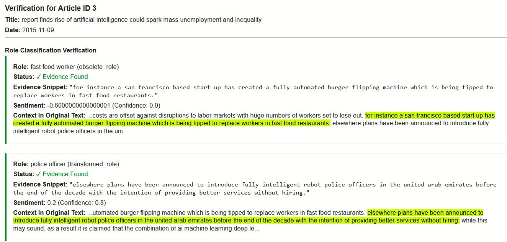

# AI’s Industrial Impacts and Policy Coverage (2014–2025): A News-Based Sentiment Analysis

**Farhad Khan**  
School of Computer Science and Engineering  
University of Electronic Science and Technology of China  
[farhadmohmand66@std.uestc.edu.cn](mailto:farhadmohmand66@std.uestc.edu.cn)

August 20, 2025

---

## Abstract

This research analyzes over 22,000 news articles from 2014 to 2025 to track the evolving discourse on Artificial Intelligence (AI) and its perceived impact on jobs, industries, and policy. Utilizing NLP techniques—including text cleaning, tokenization, and sentiment analysis via the DeepSeek API—this study categorizes mentions of specific job roles, assesses their perceived risk level (augmented, at risk, obsolete, emerging), measures associated public sentiment, and extracts prevalent policy recommendations. Key findings show a dramatic rise in media coverage focused on AI's workforce impact. Roles in technology, healthcare, and education are frequently discussed as being augmented, while positions in customer service, manufacturing, and data entry are prominently framed as at risk. Sentiment is complex and varies significantly by sector. Policy discussions are dominated by calls for training/upskilling programs and robust AI governance frameworks. This analysis offers crucial insights for policymakers, industry leaders, and individuals preparing for the future of work.

---

### Keywords  
`Artificial Intelligence` · `Sentiment Analysis` · `Natural Language Processing` · `Labor Market Disruption` · `Economic Policy` · `Workforce Transformation` · `News Media Analysis`

---

### GitHub Repository  
[https://github.com/farhadmohmand66/AI-s-Industrial-Impacts-and-Policy-Coverage-2014-2025-A-News-Based-Sentiment-Analysis](https://github.com/farhadmohmand66/AI-s-Industrial-Impacts-and-Policy-Coverage-2014-2025-A-News-Based-Sentiment-Analysis)

---

### License  
Creative Commons Attribution-NonCommercial-ShareAlike 4.0 International  
[CC BY-NC-SA 4.0](https://creativecommons.org/licenses/by-nc-sa/4.0/)

---

# 1. Introduction

The rapid advancements in Artificial Intelligence (AI) have sparked widespread debate about its potential impact on the global workforce. News media plays a crucial role in shaping public perception and understanding of these complex changes. This study investigates the narrative presented in news articles regarding AI's influence on job roles, industry dynamics, and the policy responses being discussed. By analyzing a large corpus of news data spanning over years which include about thousand roles and thousands insustries and thier impacts, we aim to quantify and characterize the evolving conversation around AI and employment, moving beyond anecdotal evidence to provide a broader, data-driven perspective. Understanding this media discourse is essential for anticipating societal responses, identifying key areas of concern, and informing proactive strategies for workforce adaptation and policy development.

## 1.1. What is Sentiment Analysis?
Sentiment Analysis is a Natural Language Processing (NLP) technique used to identify, quantify, and interpret the emotional tone expressed in text. It classifies content as positive, negative, or neutral and can also measure the strength of the opinion. In this project, sentiment analysis is applied to assess how AI’s impact on jobs is perceived across industries and roles.

Deep AI and Large Language Models (LLMs) have revolutionized sentiment analysis by moving far beyond simple polarity detection to achieve a sophisticated, context-aware understanding of text. Unlike conventional rule-based or dictionary-based methods, which struggle with nuance, sarcasm, and complex sentence structures, LLMs can infer subtle opinions and attitudes based on vast pre-trained knowledge of language. A key advanced capability is fine-grained named entity recognition (NER) and relationship extraction. For instance, when analyzing a news article discussing automation, a conventional method might completely miss the specific group being discussed or misclassify it. In contrast, a deep LLM can not only determine that the overall sentiment about "automation" is negative but can also precisely identify and extract the specific job role "workers in fast food restaurants" as the entity most affected and assigned the fast food worker to the Role field. It understands that this phrase represents a vulnerable demographic within the broader narrative, a task that is exceptionally difficult for systems reliant on static keyword lists or rigid rules, as they cannot generalize to the infinite ways such roles can be described in natural language. This allows for a much more targeted and insightful analysis, pinpointing not just how people feel, but who or what they feel that way about. The one source data is given below. 

| | |
| :-- | :-- |
| **Source Data** | fears about human workers losing their jobs to machines have been fueled by a percent increase in the number of industrial robots in the u.s. over the past decade although with investment in artificial intelligence soaring things could be about to get a lot worse. this is according to a new page report by bank of america merrill lynch which details the potential impact of the impending robot revolution on the job market. the report claims that advances in robotics and ai are leading to a phenomenon known as creative disruption whereby benefits in the shape of increased productivity and reduced costs are offset against disruptions to labor markets with huge numbers of workers set to lose out. for instance a san francisco based start up has created a fully automated burger flipping machine which is being tipped to replace **workers in fast food restaurants**. elsewhere plans have been announced to introduce fully intelligent robot police officers in the united arab emirates before the end of the decade with the intention of providing better services without hiring. while this may sound. as a result it is claimed that the combination of ai machine learning deep learning and natural user interfaces are making it possible to automate many knowledge worker tasks that were long regarded as impossible or impractical for machines to perform.  

## 1.2. Objectives and Questions to be Answered

**Objectives:**

*   To identify the most frequently discussed job roles and industries in the context of AI in news media.
*   To categorize and quantify the perceived impact of AI on these job roles (augmented, at risk, obsolete, emerging, transformed).
*   To analyze the sentiment associated with the discussion of AI's impact on specific roles and industries.
*   To track the trends in news coverage of AI's impact on jobs over time.
*   To identify and categorize the policy recommendations discussed in news articles related to AI and the workforce.
*   To provide a summary report incorporating visualizations and key insights from the analysis.

**Questions to be Answered:**

*   Which job roles and industries are most frequently mentioned in news coverage related to AI's impact on the workforce?
*   What are the dominant perceived impacts of AI on these roles (e.g., job displacement, augmentation, creation)?
*   What is the overall sentiment surrounding AI's impact on jobs as reflected in news articles, and how does it vary across roles and industries?
*   How has the news media coverage of AI's impact on jobs evolved over time?
*   What types of policy recommendations are most frequently discussed in the context of AI and the future of work?

---

# 2. Methodology

This study utilized a dataset of over 22,000 news articles related to AI and labor coverage published between 2014 and 2025 and about 34000 job roles and similarly industries mentioned, obtained from a Hugging Face dataset (`yjernite/news-ai-labor-coverage`). The analysis involved several stages which is shown in the following flow diagram with explanation:

1.  **Data Loading and Initial Cleaning:** The raw JSON data was loaded into a pandas DataFrame. Initial preprocessing steps included cleaning and normalizing text data from the 'text' and 'snippet_s' columns using custom functions that removed HTML tags, special characters, and standardized whitespace. The 'date' column was converted to a datetime format. A sample of the data was created for the analysis.
2.  **Text Truncation:** Recognizing the potential for lengthy articles and API token limits and for better accuracy, a smart truncation function was applied to the cleaned text. This function used `tiktoken` for token counting and `nltk`'s sentence tokenization, employing a TF-IDF approach to prioritize more important sentences while maintaining the original order, ensuring that key information was retained within a specified token limit (1400 tokens).
3.  **AI-Powered Extraction and Categorization:** The cleaned and truncated article text, along with article metadata, was sent in batches to the DeepSeek API (`deepseek-chat` model). A carefully designed prompt instructed the AI model to act as an AI labor market analyst and extract structured information in a strict JSON format. This information included:
    *   Explicit or inferred job roles.
    *   Associated industries.
    *   Perceived AI impact categories (`augmented`, `at_risk`, `transformed_role`, `emerging_role`, `obsolete_role`, etc.).
    *   Exact textual evidence supporting the classification.
    *   Sentiment score (-1 to 1) and confidence level (0 to 1) where detectable.
    *   Explicit policy recommendations categorized into predefined areas (`training_upskilling`, `ai_governance_ethics`, `worker_protection`, etc.).
4.  **Data Structuring and Cleaning:** The JSON output from the API was parsed using a safe JSON parsing function designed to handle potential formatting errors. The results were then flattened and structured into two separate pandas DataFrames: `df_jobs` (containing job role information) and `df_policies` (containing policy recommendations). These DataFrames underwent further cleaning, including handling null values, converting data types (e.g., sentiment score and confidence to numeric), and standardizing date formats to Year-Month.
5.  **Analysis and Visualization:** Various analytical techniques and visualizations were applied using libraries like `matplotlib`, `seaborn`, and `plotly`:
    *   **Role and Industry Counts:** Calculating the frequency of mentions for job roles and industries.
    *   **AI Impact Distribution:** Analyzing the counts of each AI impact category.
    *   **Sentiment Analysis:** Examining the distribution and average sentiment scores for roles and industries.
    *   **Time Series Analysis:** Tracking the mentions of different AI impacts over time.
    *   **Heatmaps:** Visualizing the intersection of industries and AI impact categories.
    *   **Word Clouds:** Generating word clouds from the extracted evidence to identify prevalent terminology associated with AI's impact on jobs in different years.
    *   **Policy Category Distribution:** Analyzing the frequency of different policy recommendations.
6.  **Validation:** A verification function was developed to randomly sample analyzed articles and compare the extracted job roles, impacts, and evidence snippets against the original cleaned text, highlighting the evidence found in the original article to assess the accuracy of the AI extraction process.

---

# 3. Findings

The analysis of news media coverage on AI's impact on the job market from 2014 to 2025 reveals several key trends and insights:

## 3.1. Most Discussed Job Roles and Industries

As shown in the **Top 10 Most Discussed Job Roles in AI Context** plot below, the most frequently mentioned job roles in the context of AI and its impact include 'AI ethicist', 'HR professional', 'journalist', and 'data scientist'. This highlights the media's focus on roles directly involved with AI development, those responsible for managing human capital amidst AI integration, and professions whose nature is being actively debated in the AI era.

The **Count of each industry** output indicates that the 'tech' industry dominates the conversation, followed by 'healthcare' and 'education'. This suggests that news coverage primarily focuses on the impact of AI within these sectors, likely due to the high rate of AI adoption and the significant societal implications of changes in these areas.

## 3.2. Distribution of AI Impact Categories

The **Count of each AI Impact Category** output shows that 'augmented' and 'emerging_role' are the most frequently mentioned AI impacts. This suggests a significant portion of the media narrative focuses on how AI enhances existing jobs and creates new ones. However, 'at_risk' and 'transformed_role' also represent substantial categories, indicating that concerns about job displacement and fundamental changes to roles are still prominent. 'Obsolete_role' is mentioned less frequently in comparison but still constitutes a notable category. The details figures are mentioned below.

#### Trend of AI Impact Mentions Over Time

The **Yearly Trend of Selected AI Impact Categories** plot part of the combined analysis in the below figure clearly illustrates the dramatic increase in news coverage discussing AI's impact on jobs, particularly from around 2022 onwards. The stacked area chart shows how the different impact categories contribute to the overall volume of discussion each year. While all selected categories ('obsolete_role', 'at_risk', 'transformed_role', 'augmented', 'emerging_role') show an increasing trend in mentions, the rapid rise in discussion around 'augmented' and 'emerging_role' is particularly noticeable in recent years, aligning with the overall distribution observed. The figure of distribution of AI impact category, impacts pie chart and year trend shown in combined below.

  

## 3.3. Industry Vulnerability to AI Displacement

The Heatmap visualizing **Industry Vulnerability to AI Displacement** provides a focused view on the 'at_risk' and 'obsolete_role' categories across the top 20 industries. It confirms that the 'tech' industry, despite also having high mentions of 'augmented' and 'emerging_role', also shows a significant number of roles classified as 'at_risk'. Industries like 'manufacturing', 'customer service', 'retail', and 'finance' also show considerable vulnerability, with notable counts in both 'at_risk' and 'obsolete_role' categories. This highlights that concerns about job displacement are not limited to a single sector but are present across diverse industries. The figure are given below. 

## 3.4. Sentiment Analysis Results

The **Top 10 Roles by Positive AI Sentiment** plot identifies roles like 'Prompt Engineer / LLM Specialist', 'AI Research Scientist', and 'Generative AI Engineer' as having the highest average sentiment scores. This indicates a generally positive framing of roles directly involved with AI development and application, likely reflecting the excitement and optimism around these emerging fields. The figure given below.

Conversely, the **Sentiment Distribution of At-Risk Roles** boxplot shows a concentration of sentiment scores in the negative range for roles identified as 'at_risk' or 'obsolete_role'. The boxplot's median is clearly below zero, indicating that the media narrative around roles facing displacement is predominantly negative, reflecting concerns about job losses and the challenges of automation. The plot Sentiment Distribution of At-Risk Roles are given below.

The **Top 12 Industries by AI Sentiment** boxplot provides a comparative view of sentiment across different prominent industries. Industries like 'tech', 'design', and 'business' show a tendency towards more positive sentiment scores, while industries like 'customer service', 'manufacturing', and 'legal' lean towards more negative sentiment, aligning with their perceived vulnerability to AI displacement seen in the following Heatmap.

## 3.5. Insights from Word Clouds

The **Evolution of AI Impact Language** word clouds provide a visual representation of the most frequent terms used in the extracted evidence snippets over different years (e.g., 2022, 2023, 2024, 2025). By comparing word clouds across years, we can observe shifts in the terminology used to describe AI's impact. For instance, earlier years might show more general terms, while recent years might highlight more specific AI technologies (like 'generative AI') or roles ('prompt engineer'), reflecting the evolving nature of AI and the discourse surrounding it. Words like 'jobs', 'human', 'roles', 'tasks', and 'workers' remain consistently prominent, underscoring the human-centric focus of the media coverage. The figures of key terms discussed in year wise given below.

## 3.6. Distribution of Policy Categories

The pie chart showing the **Distribution of Key Policy Categories** given below, reveals that 'training_upskilling' and 'ai_governance_ethics' are the most frequently discussed policy areas in news articles related to AI and the workforce. This suggests that the media narrative emphasizes the need for individuals to adapt to the changing job market through learning new skills and the importance of establishing ethical guidelines and regulations for AI development and deployment. 'Worker_protection', 'economic_transition_support', and 'innovation_incentives' are also discussed but less frequently.

## 3.7 Validation

To ensure the reliability of the extracted data, a validation step was implemented. The `verify_role_classification` function allows for the manual inspection of the AI model's output for individual articles. By providing an article ID, the function retrieves the original cleaned text, the extracted job roles, their classified impacts, and the specific evidence snippets provided by the AI. It then searches for these evidence snippets within the original text and highlights them, as demonstrated in the output shown in following figure. This allows for a qualitative assessment of whether the AI correctly identified the relevant sections of text and accurately interpreted the AI impact and sentiment based on that evidence. While not a comprehensive quantitative validation of the entire dataset, this process provides confidence in the model's ability to perform the extraction task as specified by the prompt. Discrepancies observed during this validation (e.g., evidence not found or misclassified roles) can inform refinements to the AI prompt or post-processing steps.

---

# 4. Recommendations

Based on the findings of this analysis, the following recommendations are proposed:

*   **For Policymakers:** Given the significant discussion around 'training_upskilling' and 'ai_governance_ethics', policymakers should prioritize initiatives in these areas. This includes investing in accessible and effective reskilling programs for workers in vulnerable industries and roles, and developing clear, ethical guidelines and regulatory frameworks for AI development and deployment to build public trust and ensure responsible innovation. The prevalence of 'at_risk' and 'obsolete' roles in certain industries also warrants consideration of economic transition support programs.
*   **For Educators and Institutions:** Educational institutions should adapt curricula to focus on skills that are augmented by AI (e.g., critical thinking, creativity, complex problem-solving) and those required for emerging AI-related roles. Promoting digital literacy and continuous learning is crucial for preparing individuals for a dynamic job market.
*   **For Workers:** Individuals should proactively engage in continuous learning and skill development, focusing on areas that are either augmented by AI or represent emerging opportunities. Understanding the potential impacts of AI on their specific roles and industries, as highlighted in this research, can inform career planning and decisions.
*   **For Industry Leaders:** Businesses should focus on strategies that leverage AI to augment human capabilities rather than solely aiming for automation-driven displacement. Investing in upskilling their existing workforce and fostering a culture of continuous learning can lead to a more resilient and adaptable organization.

---

# 5. Conclusion

This research provides a data-driven overview of how news media has portrayed the impact of AI on the job market between 2014 and 2025. The analysis reveals a growing and evolving conversation, with a dual focus on both the potential for AI to augment and create new roles, as well as the persistent concerns about job displacement and transformation. While 'tech', 'healthcare', and 'education' are central to the discussion, industries like customer service and manufacturing face significant perceived risks. The media narrative emphasizes the importance of training, upskilling, and responsible AI governance as key responses to these changes.

Future research could expand upon this analysis by:

*   Performing a more in-depth sentiment analysis, potentially using more nuanced models to capture specific emotions or attitudes towards AI's impact.
*   Analyzing the geographic distribution of the news coverage and its potential correlation with regional economic impacts.
*   Investigating the types of sources (e.g., traditional news outlets, industry publications, academic journals) and their differing perspectives on AI's impact.
*   Tracking the implementation and effectiveness of the discussed policy recommendations over time.

By continuing to monitor and analyze the public discourse surrounding AI and employment, we can gain valuable insights to help navigate the ongoing transformation of the workforce and build a more inclusive and prosperous future.

